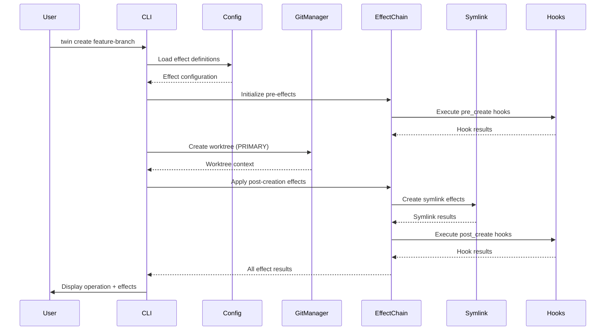
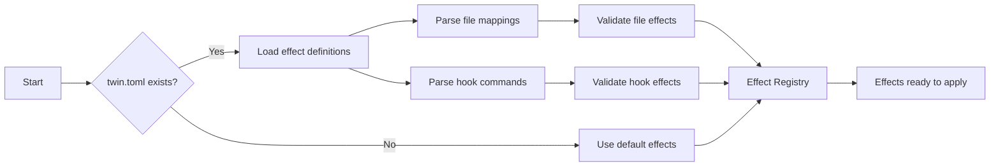
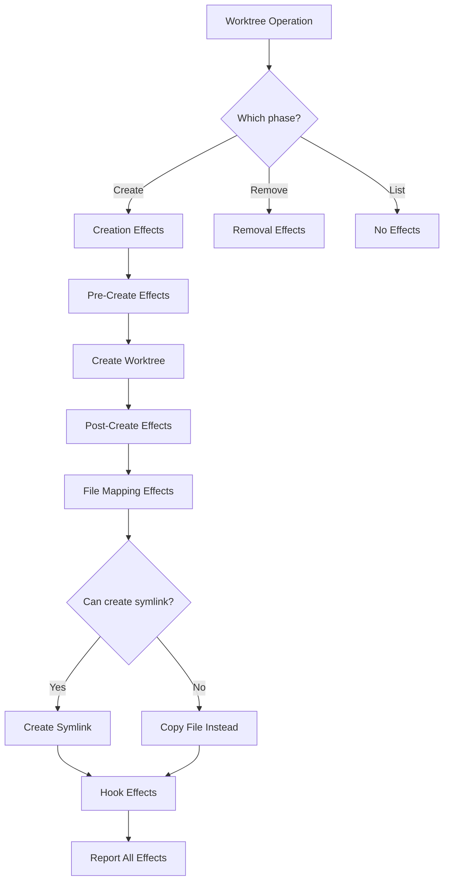
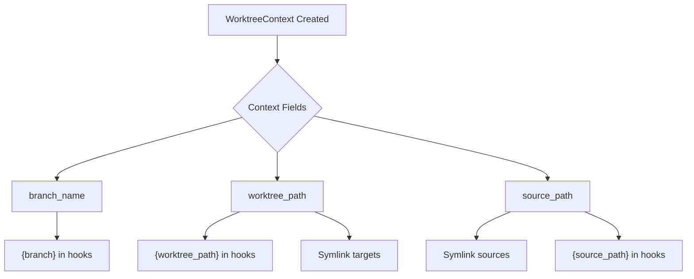
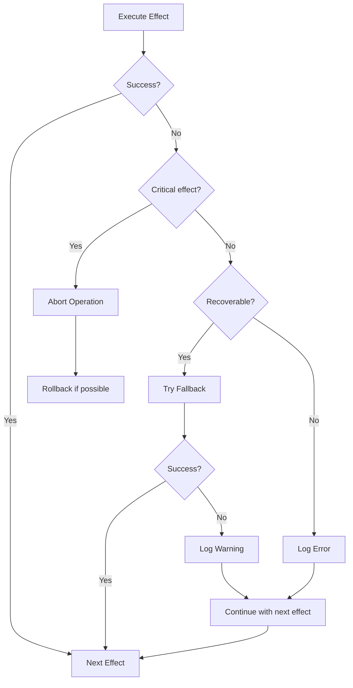
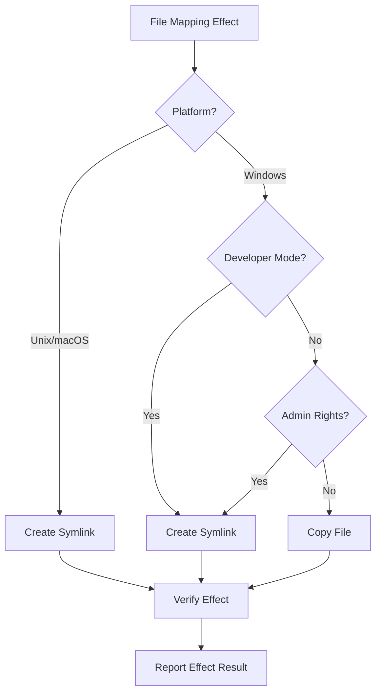
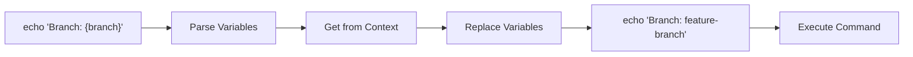
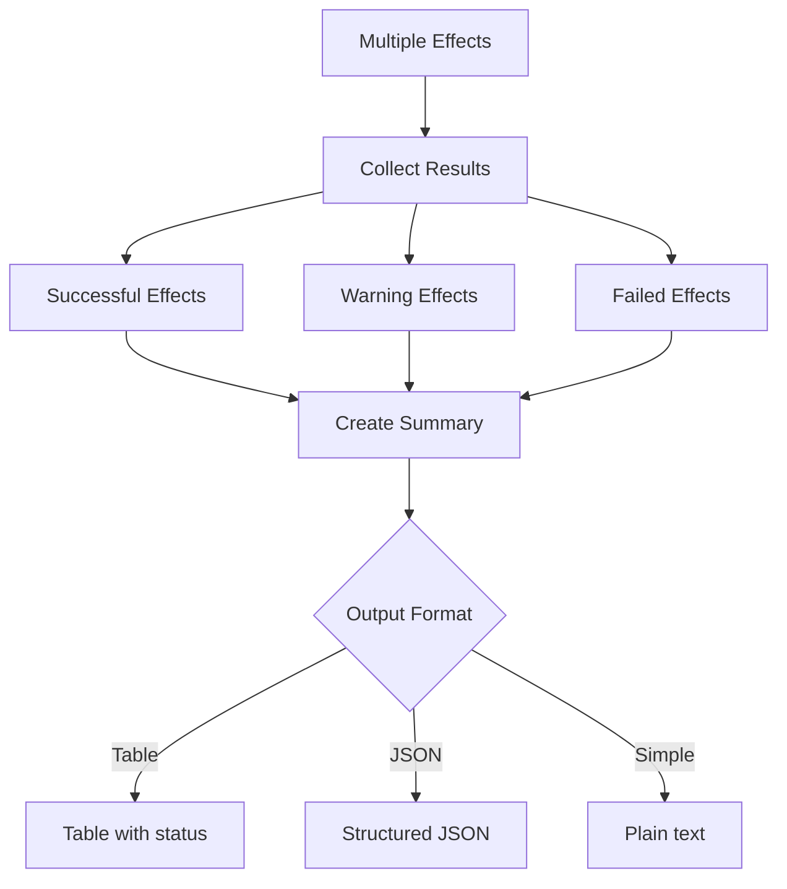

# Data Flow

Understanding how data flows through Twin reveals its effect-oriented architecture.

## Primary Operation Flow with Effects



## Effect Configuration Flow



## Effect Execution Strategy



## Effect Context Propagation

The `WorktreeContext` flows through all effects, providing necessary information:



## Effect Error Handling Flow



## Platform-Specific Effect Resolution



## Hook Effect Variable Substitution

Variables in hook commands are replaced with context values:



## Effect Result Aggregation



## Lifecycle Effect Timing

The timing of effects is crucial for proper operation:

```mermaid
gantt
    title Effect Execution Timeline
    dateFormat X
    axisFormat %s
    
    section Pre-Create
    Validate Config     :0, 1
    Pre-Create Hooks    :1, 2
    
    section Primary Operation
    Create Worktree     :2, 4
    
    section Post-Create
    Create Symlinks     :4, 5
    Copy Files          :4, 5
    Post-Create Hooks   :5, 7
    
    section Finalize
    Report Results      :7, 8
```



## Data Structures Flow

Key data structures and their transformation through the system:

```rust
// 1. User Input
CreateArgs { branch: "feature", path: None }
    ↓
// 2. Configuration + Defaults
Config { files: [...], hooks: [...] }
    ↓
// 3. Worktree Context
WorktreeContext {
    branch_name: "feature",
    worktree_path: "/path/to/feature",
    source_path: "/path/to/repo"
}
    ↓
// 4. Effect Execution
Vec<EffectResult> [
    SymlinkResult { success: true, ... },
    HookResult { success: true, ... }
]
    ↓
// 5. User Output
"✓ Created worktree 'feature' with 2 effects applied"
```

Source: [src/git.rs#L65-660](https://github.com/your-org/twin/blob/main/src/git.rs#L65-660), [src/hooks.rs#L75-118](https://github.com/your-org/twin/blob/main/src/hooks.rs#L75-118)