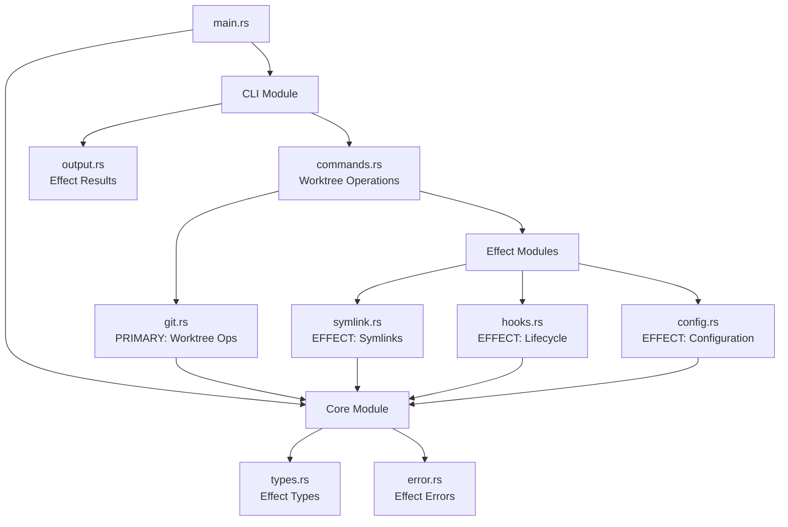

# Module Structure

Twin's modular architecture reflects its core concept: a Git worktree wrapper that manages effects.

## Module Dependency Graph



## Module Categories

### Primary Module (Git Operations)

#### `git.rs` - Git Worktree Operations
The core module that all effects revolve around:
- `GitManager`: Wrapper for Git worktree operations
- `WorktreeInfo`: Metadata about created worktrees
- `BranchInfo`: Branch state information
- Provides context for all effects to operate on

### Effect Modules

#### `symlink.rs` - Symlink Effect Module
Manages symlink creation as an effect of worktree operations:
- `SymlinkManager` trait: Effect abstraction
- `UnixSymlinkManager`: Unix/Linux/macOS effect implementation
- `WindowsSymlinkManager`: Windows effect implementation with fallbacks
- Effect strategies based on platform capabilities

#### `hooks.rs` - Lifecycle Effect Module
Executes commands as effects of worktree lifecycle events:
- `HookExecutor`: Manages effect execution timing
- `HookContext`: Provides worktree context to effects
- `HookResult`: Effect execution outcomes
- Variable substitution for dynamic effects

#### `config.rs` - Configuration Effect Module
Loads and manages effect definitions:
- Effect configuration from TOML
- Default effect behaviors
- Effect merging and precedence
- Path resolution for effect targets

### Support Modules

#### `cli/` - Command Interface Module
Translates user commands into worktree operations and effect triggers:
- **`commands.rs`**: Operation handlers that orchestrate effects
  - `handle_create()`: Create worktree + apply creation effects
  - `handle_remove()`: Remove worktree + apply removal effects
  - `handle_list()`: List worktrees (no effects)
- **`output.rs`**: Formats effect results for users
  - Table format showing effect status
  - JSON format for programmatic effect reporting
  - Simple format for scripting

#### `core/` - Core Types Module
Defines the fundamental effect system:
- **`types.rs`**: Effect data structures
  - `FileMapping`: File effect definition
  - `HookCommand`: Command effect definition
  - `PartialFailureState`: Effect failure recovery
  - `MappingType`: Effect strategies (symlink, copy, template)
- **`error.rs`**: Effect error hierarchy
  - `TwinError`: Categorized effect errors
  - Error context for effect debugging
  - Recovery strategies for effect failures

#### `utils.rs` - Utility Module
Supporting functions for effect implementation:
- `FileLock`: Ensures atomic effect operations
- Path utilities for effect target resolution
- Platform detection for effect strategy selection

## Module Interaction Patterns

### Effect Registration Flow
```rust
// 1. User command triggers operation
cli::commands::handle_create(args)
    // 2. Primary operation creates worktree
    -> git::GitManager::create_worktree()
    // 3. Load effect definitions
    -> config::Config::load()
    // 4. Apply effects in order
    -> symlink::create_effects()
    -> hooks::execute_effects()
    // 5. Report effect results
    -> output::format_results()
```

### Effect Context Propagation
```rust
struct WorktreeContext {
    branch_name: String,
    worktree_path: PathBuf,
    source_path: PathBuf,
}

// Context flows through all effects
symlink_effect.apply(&context)?;
hook_effect.apply(&context)?;
```

### Platform Effect Selection
```rust
// Effect implementation selected at runtime
let effect_manager: Box<dyn SymlinkEffect> = if cfg!(windows) {
    Box::new(WindowsSymlinkManager::new())
} else {
    Box::new(UnixSymlinkManager::new())
};
```

## Module Responsibilities

### Separation of Concerns

1. **Git Operations** (`git.rs`): Only handles Git worktree operations
2. **Effect Modules** (`symlink.rs`, `hooks.rs`): Only handle their specific effects
3. **Configuration** (`config.rs`): Only handles effect definitions
4. **CLI** (`cli/`): Only handles user interaction and effect orchestration
5. **Core** (`core/`): Only defines types and errors for the effect system

### Module Communication

Modules communicate through well-defined interfaces:
- Effects receive `WorktreeContext` from Git operations
- Effects return `Result<EffectOutcome>` to CLI
- Configuration provides `EffectDefinition` to effect modules
- Errors bubble up through the effect chain with context

## Extension Points

The modular structure allows easy addition of new effects:

1. **New Effect Type**: Add a new effect module (e.g., `permission.rs`)
2. **New Platform**: Add a new strategy implementation in existing effect modules
3. **New Lifecycle Point**: Extend hook effects with new timing options
4. **New Configuration Source**: Extend config module with new loaders

Source: [src/main.rs#L1-16](https://github.com/your-org/twin/blob/main/src/main.rs#L1-16), [src/cli/commands.rs](https://github.com/your-org/twin/blob/main/src/cli/commands.rs), [src/core/types.rs](https://github.com/your-org/twin/blob/main/src/core/types.rs)