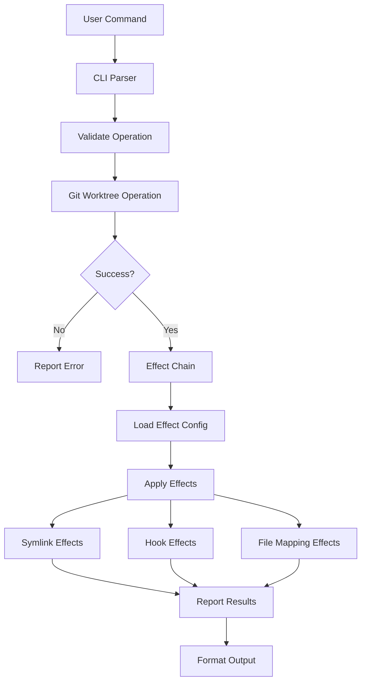

# System Design

Twin's system design centers around the concept of Git worktree operations and their associated effects.

## Core Design Philosophy

Twin is designed as a **Git worktree wrapper with effect management**. Every action is viewed through this lens:

1. **Primary Operation**: Git worktree manipulation (create, list, remove)
2. **Effects**: Side effects that occur as a result of the primary operation
3. **Effect Types**:
   - **Immediate Effects**: Symlinks, file copies (executed during operation)
   - **Lifecycle Effects**: Hooks (executed at specific points)
   - **Persistent Effects**: Configuration state (maintained across operations)

## Design Principles

### 1. Effect-Oriented Architecture
Every feature is an effect of a worktree operation:
- Creating symlinks is an effect of worktree creation
- Running setup commands is an effect of worktree lifecycle
- File mappings are effects applied to the worktree

### 2. Declarative Effect Configuration
Effects are declared in configuration, not imperatively coded:
```toml
# Declare effects, don't program them
[[files]]  # File mapping effect
source = ".env.template"
target = ".env"

[hooks]  # Lifecycle effect
post_create = [{ command = "npm install" }]
```

### 3. Effect Isolation
Each effect is independent and can fail without affecting others:
- Symlink creation failure doesn't prevent hook execution
- Hook failure doesn't rollback worktree creation
- Effects are applied in a defined order but isolated

### 4. Platform Abstraction for Effects
Effects behave consistently across platforms:
- Symlink effects fall back to copy on Windows without symlink support
- Path effects are normalized across OS boundaries
- Hook effects use platform-appropriate shells

## Module Organization by Responsibility

```
src/
├── main.rs           # Entry point, dispatches worktree operations
├── cli/              # Command interface for worktree operations
│   ├── commands.rs   # Worktree operation handlers
│   └── output.rs     # Effect result formatting
├── core/             # Core effect definitions
│   ├── types.rs      # Effect data structures
│   └── error.rs      # Effect error types
├── git.rs            # PRIMARY: Git worktree operations
├── symlink.rs        # EFFECT: Symlink creation effects
├── hooks.rs          # EFFECT: Lifecycle hook effects
├── config.rs         # Effect configuration management
└── utils.rs          # Effect support utilities
```

## Design Patterns

### Effect Pattern
All side effects are modeled as effects of worktree operations:
```rust
pub trait Effect {
    fn apply(&self, context: &WorktreeContext) -> Result<()>;
    fn can_apply(&self, context: &WorktreeContext) -> bool;
    fn rollback(&self, context: &WorktreeContext) -> Result<()>;
}
```

### Strategy Pattern for Platform Effects
Platform-specific effect implementations:
```rust
pub trait SymlinkEffect {
    fn create_link(&self, source: &Path, target: &Path) -> Result<()>;
}

// Platform strategies implement the effect differently
impl SymlinkEffect for WindowsStrategy { ... }
impl SymlinkEffect for UnixStrategy { ... }
```

### Chain of Responsibility for Effect Execution
Effects are chained and executed in sequence:
```rust
pub struct EffectChain {
    effects: Vec<Box<dyn Effect>>,
}

impl EffectChain {
    pub fn execute(&self, context: &WorktreeContext) -> Result<()> {
        for effect in &self.effects {
            effect.apply(context)?;
        }
        Ok(())
    }
}
```

## Error Handling Philosophy

Errors are categorized by their impact on effects:

1. **Critical Errors**: Prevent worktree operation (e.g., Git repository not found)
2. **Effect Errors**: Individual effect failures (e.g., symlink creation failed)
3. **Warning-Level Effects**: Non-critical effect failures (e.g., optional hook failed)

```rust
pub enum TwinError {
    // Critical - stops everything
    GitOperationError(String),
    
    // Effect-specific - may continue
    EffectError { 
        effect_type: String,
        recoverable: bool,
        message: String,
    },
    
    // Warnings - always continue
    EffectWarning(String),
}
```

## Data Flow Architecture



## Effect Execution Model

Effects are executed in a specific order to ensure consistency:

1. **Pre-operation effects** (pre_create hooks)
2. **Primary operation** (Git worktree creation)
3. **Immediate effects** (symlinks, file mappings)
4. **Post-operation effects** (post_create hooks)

This ordering ensures that:
- Validation happens before any changes
- The worktree exists before file effects are applied
- Setup commands run after all files are in place

Source: [src/core/error.rs#L11-86](https://github.com/your-org/twin/blob/main/src/core/error.rs#L11-86), [src/symlink.rs#L24-54](https://github.com/your-org/twin/blob/main/src/symlink.rs#L24-54)