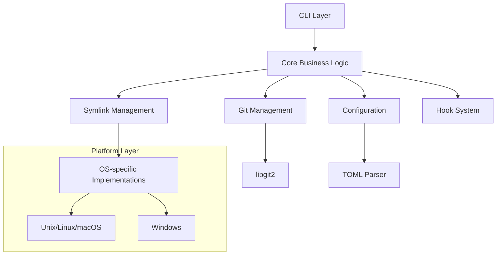

# Architecture Overview

Twin follows a modular architecture designed for extensibility and cross-platform compatibility.

## High-Level Architecture

## Component Responsibilities

### CLI Layer (`src/cli/`)
- Command parsing and validation
- Output formatting (table, JSON, simple)
- User interaction handling

### Core Module (`src/core/`)
- Central types and data structures
- Error handling and propagation
- Business logic coordination

### Git Management (`src/git.rs`)
- Worktree operations (create, list, remove)
- Branch management
- Repository validation

### Symlink Management (`src/symlink.rs`)
- Platform-specific symlink creation
- Permission handling
- Fallback strategies (copy mode)

### Configuration (`src/config.rs`)
- TOML file parsing
- Configuration merging
- Default values

### Hook System (`src/hooks.rs`)
- Lifecycle event handling
- Command execution
- Variable substitution

Source: [src/main.rs#L1-16](https://github.com/your-org/twin/blob/main/src/main.rs#L1-16)