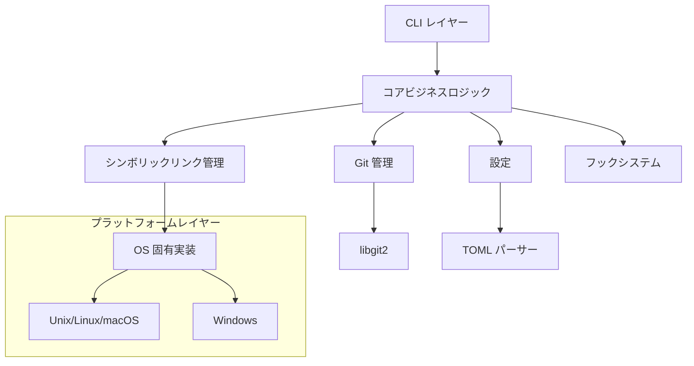

# アーキテクチャ概要

[English](Getting-Started-Architecture-Overview) | **日本語**

Twin は拡張性とクロスプラットフォーム互換性を考慮して設計されたモジュラーアーキテクチャに従っています。

## ハイレベルアーキテクチャ

## コンポーネントの責務

### CLI レイヤー (`src/cli/`)
- コマンドの解析と検証
- 出力フォーマット（テーブル、JSON、シンプル）
- ユーザーインタラクション処理

### コアモジュール (`src/core/`)
- 中心的な型とデータ構造
- エラーハンドリングと伝播
- ビジネスロジックの調整

### Git 管理 (`src/git.rs`)
- ワークツリー操作（作成、リスト、削除）
- ブランチ管理
- リポジトリ検証

### シンボリックリンク管理 (`src/symlink.rs`)
- プラットフォーム固有のシンボリックリンク作成
- 権限処理
- フォールバック戦略（コピーモード）

### 設定 (`src/config.rs`)
- TOML ファイル解析
- 設定のマージ
- デフォルト値

### フックシステム (`src/hooks.rs`)
- ライフサイクルイベント処理
- コマンド実行
- 変数置換

ソース: [src/main.rs#L1-16](https://github.com/your-org/twin/blob/main/src/main.rs#L1-16)